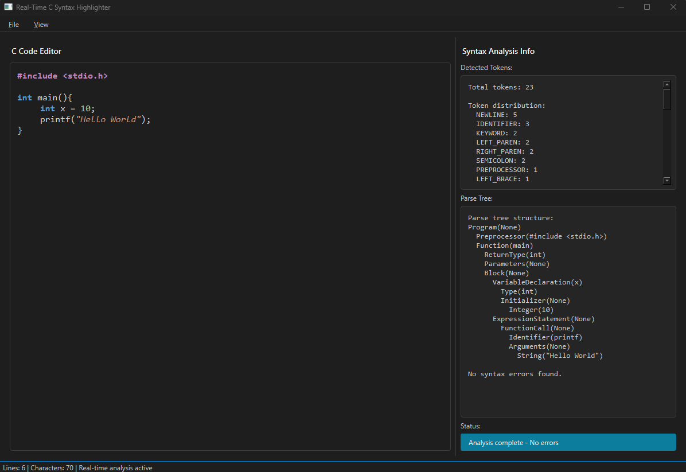

# 🧠 Gerçek Zamanlı C Sözdizimi Vurgulayıcı

Python ile geliştirilmiş, C programlama dili için gerçek zamanlı çalışan etkileşimli sözdizimi analiz ve renklendirme aracı.



## 📌 Genel Bakış

Bu proje, C dilinde yazılmış kodları **anlık olarak analiz eden** ve kullanıcıya hem **renkli sözdizimi vurgulama** hem de **yapısal geri bildirim** sunan bir araç sunmaktadır. Sistem, lexer ve parser katmanlarını özelleştirilmiş bir PyQt6 arayüzü ile birleştirir.

---

## 🎯 Özellikler

- ✅ Gerçek zamanlı sözcüksel analiz (lexer)
- ✅ Recursive descent ile sözdizimi çözümleme (parser)
- ✅ Canlı sözdizimi renklendirme
- ✅ Hata toparlama ve sonsuz döngü koruması
- ✅ PyQt6 tabanlı modern kullanıcı arayüzü


---

## 🖥️ Kullanılan Teknolojiler

| Bileşen           | Teknoloji                                           |
|-------------------|-----------------------------------------------------|
| Arayüz            | PyQt6                                               |
| Lexer             | Durum Diagramı + Tablo yönlendirmeli implementasyon |
| Parser            | Recursive Descent                                   |
| Stil              | Özel QSS (dark theme)                               |

---

## 📂 Proje Yapısı

```
proje/
├── main.py                  # Uygulama
├── dark_stylesheet.qss      # Uygulama tema renkleri
├── c_lexer_base.py          # Token türleri ve durum geçiş tablosu
├── c_lexer_main.py          # Lexer implementasyonu
├── parser.py                # Parser - AST üretimi
├── gui_integraation.py      # Analiz bilgilerinin gui'ye aktarılması
├── img/                     # Ekran görüntüleri klasörü
└── README.md                
```

---

## 📄 Belgeler ve Bağlantılar

- 📘 [Proje Raporu (PDF)](PD_DonemProjesi_HasnaSahinoglu_22360859005.pdf)
- ✍️ [Medium Yazısı](https://medium.com/@hasna.sahinoglu/ger%C3%A7ek-zamanl%C4%B1-c-s%C3%B6zdizimi-vurgulama-sistemi-python-ile-derleyici-uygulamas%C4%B1-7b8eea2ba2c8)

---

## 🚀 Başlarken

1. **Projeyi klonlayın**
   ```bash
   git clone https://github.com/kullanici-adi/c-syntax-highlighter.git
   cd c-syntax-highlighter
   ```

2. **Sanal ortam oluşturun**
   ```bash
   python -m venv venv
   source venv/bin/activate  # Windows için: venv\Scripts\activate
   ```

3. **Gereksinimleri yükleyin**
   ```bash
   pip install -r requirements.txt
   ```

4. **Uygulamayı başlatın**
   ```bash
   python main.py
   ```


